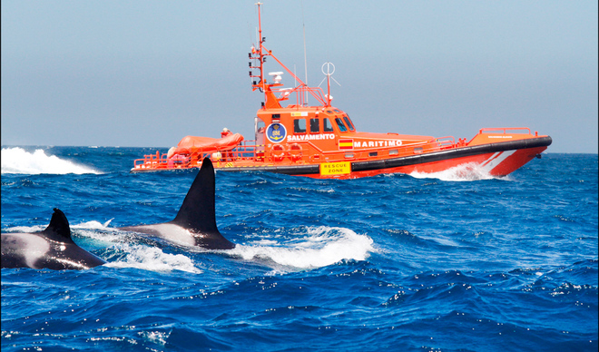
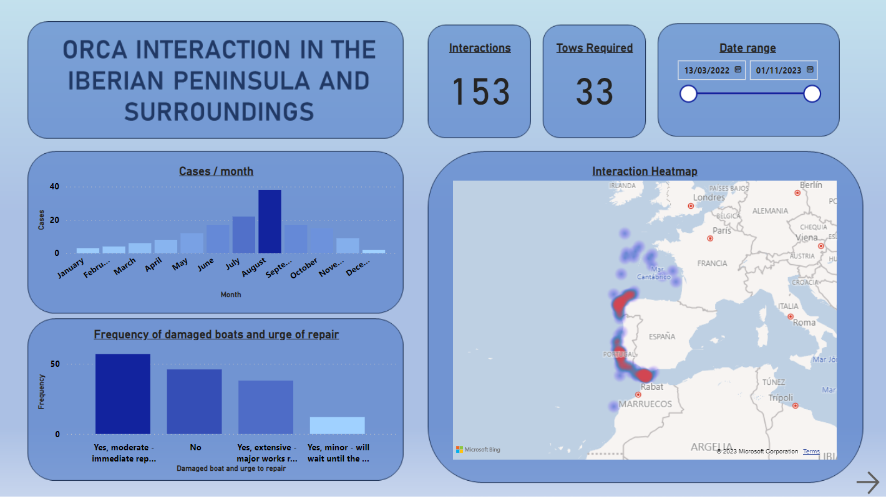

# Orca interactions in the Iberian Peninsula 

##  Introducción

Este proyecto forma parte del trabajo final del curso de Análisis de Datos en Ironhack, cursado de octubre a diciembre del año 2023.

A continuacón se incluye el proceso llevado a cabo desde la obtención de la base de datos hasta el posterior análisis y presentación de resultados vía Power BI.

Se ha escogido como foco del estudio el reciente auge en casos de interacciones de orcas con barcos en la Península Ibérica y alrededores. Motivado por conocer si existen factores en común entre las interacciones, se decide graficar y presentar los datos una vez se ha montado una base de datos consistente.

## Obtención BBDD
En primer lugar, resulta fundamental dar con una base de datos de hechos reales en los que poder basar el estudio. Para ello se deben mencionar dos grandes partes que han hehco posible el estudio.

1) Grupo de Trabajo de la Orca Atlántica (GTOA)

Este equipo de biólogos marinos se dedica a contribuir en la conservación y gestión de la Orca Atlántica. Esta es una subpoblación singular de las orcas que habita en aguas  de la península y las protagonistas de las interacciones con los navíos.

2) Cruising Association (CA) 

Es una asociación dedicada a navegantes de pequeñas embarcaciones con base en Reino Unido. Aunque también centran sus esfuerzos en proteger esta especie protegida de cetáceos, tienen la misión de trabajar conjuntamente con el GTOA para proteger a los marineros y prevenir que las interacciones con esta subpoblación termine con daños humanos o materiales de grandes dimensiones.

Gracias al trabajo realizado por estas dos partes, el autor de este proyecto ha utilizado el método de raspado web (más conocido por el anglicismo *web scraping*) para formar una base de datos. Esta metodología de obtenicón de información se ha aplicado sobre la siguiente [web](https://www.theca.org.uk/orcas/reports). Aquí se puede encontrar una lista con los formularios rellenados por los patrones de las embarcaciones que vivieron una interacción con orcas en algun punto cercano a la península. 

Pese a que no todos los cuestionarios contestados coincidieran en formato y forma, en la siguiente lista desplegable se pueden encontrar las columnas de la BBDD así como una pequeña descripción del contenido de la misma:

Columnas de la BBDD:

 

* **date**: Fecha y hora aproximada de la interacción
* **lat_and_long**: Latitud y longitud donde se dio la interacción
* **GTOA_Protocol**: Se siguió el *protocolo* de GT Orca Atlántica: Arriar las velas, detener la embarcación, apagar el motor y mantener un perfil bajo así como *duración* de la interacción
* **Boat_Type**: Tipo de barco - Velero | Motor | Barco de pesca
* **Boat_Length**: Eslora del barco (m) - menos de 10m | 10-12.5 | 12.5-15m | Más de 15m
* **Towing_Inflatable**: Se encontraba el barco remolcando una lancha neumática?
* **Trailing_Fishing_Lure**: Se encontraba el barco arrastrando un señuelo de pesca?
* **Physical_Contact_With_Boat**: Hubo contacto físico de las orcas con la embarcación?
* **Number_of_Adult_Orcas**: Número de orcas adultas?
* **Number_of_Juvenile_Orcas**: Número de orcas juveniles?
* **Number_of_Uncertain_Age_Orcas**: Número de orcas de edad incierta?
* **Rudder**: Tipo de timón - Spade/pala | Semi skeg/Semicompensado | Full skeg/Completo | Twin rudder/Doble timón | Keel hung/Quilla corrida
* **Motoring_or_Sailing**: Motor o vela - Vela | Motor | Motor/Vela | Hove-to
* **Speed_Knots**: Velocidad (kts)
* **Sea_State**: Estado del mar - Calma | Moderado | Gruesa
* **Wind_Speed_Beaufort**: Velocidad del viento (Escala de Beaufort) - 0.2 | 3-4 | 5-6 | 7+
* **Daylight_or_Darkness**: Noche/Día - Amanecer | Día | Atardecer | Noche
* **Cloud_Cover**: Cobertura de nubes - 0-25% | 25-50% | 50-75% | 75-100%
* **Distance_Off_Land_NM**: Distancia a tierra (nm) - 0-2 | 2-5 | 5-10 | Más de 10
* **Depth_Meters**: Profundidad (m) - hasta 20m | 20-40m | 40-200m | 200m+
* **Depth_Gauge**: Medidor de profundidad - On | Off
* **Autopilot**: Piloto automático - On | Off
* **Hull_Topsides_Color**: Color del casco - Blanco | Oscuro
* **Antifoul_Color**: Color del antifoul - Negro | Azul | Rojo | Blanco | Verde | Coppercoat | Otro
* **Boat_Damaged**: Fue dañado el barco o necesita reparación alguna? Sí, menor | Sí, moderado | Sí, grandes reparaciones | No
* **Tow_Required**: ¿Fue remolcado? - Yes | No
* **Crew_Response**: Descripción abierta de la interacción así como acciones que se tomaron y su estas  disuadieron o no la interacción con las orcas.
* **Orcas_Behaviour**: Descripción del comportamiento de la/s orca/s

Se anima al lector a profundizar en el código desarrollado para recolectar la información arriba mencionada. Se puede encontrar el código comentado y desarrollado en Python en el notebook [1.WebScraping.ipynb](https://github.com/Jacobomb/Orca-interactions-in-the-Iberian-Peninsula/blob/main/notebooks/1.WebScraping.ipynb). 

## Limpieza y completado de la BBDD

El siguiente paso del proyecto fue el de limpiar la base de datos de posibles errores que se hubieran dado en el raspado web. Dado que el raspado es una automatización de un proceso iterativo que va circulando por la web y grabando la información de utilidad en un dataframe, en el momento que un formulario tenga un orden distinto a los anteriores, se darán errores de dimensión y forma.

Esta parte se divide en dos notebooks distintos:

* [Data Cleaning](https://github.com/Jacobomb/Orca-interactions-in-the-Iberian-Peninsula/blob/main/notebooks/2.DataCleaning.ipynb): En este notebook se aseguró que la información contenida en cada columna debía estar ahí. Se hizo uso del comando de Pandas [value_counts()](https://pandas.pydata.org/docs/reference/api/pandas.Series.value_counts.html) para comprobar los valores únicos de cada columna. Fue de gran utilidad que el formulario a rellenar por los patrones fuera de opción múltiple en lugar de respuesta abierta, esto simplificó el proceso de limpieza. Además, en este notebook se corrigieron aquellas filas que estaban descolocadas. El último proceso llevado a cabo en este notebook fue el de cambiar los tipos de datos de algunas columnas. Por la manera en que se había extraído el dato, inicialmente todas las columnas eran de tipo objeto y se cambiaron aquellas que lo permitieran a tipo númerico (entero o flotante) o de tipo `datetime` para la columna que contenía la fecha.

* [Data Filling](https://github.com/Jacobomb/Orca-interactions-in-the-Iberian-Peninsula/blob/main/notebooks/3.DataFilling.ipynb): En este notebook se llevó a cabo un proceso de llenado de datos manual debido a un cambio en el formato del formulario. En gran medida se pudieron rellenar los datos vacíos gracias a las únicas dos casillas de *respuesta abierta* que existían. Estas son *Crew_Response* y *Orcas_Behaviour*. 

El proceso de limpieza o transformado de datos es clave en todo proyecto y por tanto se anima al lector a profundizar en su lectura para descubrir técnicas y/o métodos de limpieza.

## Carga de la BBDD

Una vez se ha recogido, limpiado y completado toda la información en un archivo de tipo CSV que se puede encontrar en la carpeta [data](https://github.com/Jacobomb/Orca-interactions-in-the-Iberian-Peninsula/tree/main/data), el siguiente paso constó en cargar la información a [MySQL Workbench](https://www.mysql.com/products/workbench/). Este es un programa desarrollado por Oracle que permite administrar remotamente bases de datos. 

En el notebook [4.DataLoading.ipynb](https://github.com/Jacobomb/Orca-interactions-in-the-Iberian-Peninsula/blob/main/notebooks/4.DataLoading.ipynb) se puede seguir el proceso para llevar a cabo la creación de la base de datos desde Python. Una vez se ha creado esta, se da forma a la tabla donde estará contenida toda la información de las interacciones orcas-barcos. La query de creación de la tabla está contenida en la carpeta [SQL](https://github.com/Jacobomb/Orca-interactions-in-the-Iberian-Peninsula/tree/main/SQL). Con la base montada, se puede cargar la información proveniente del archivo CSV.

## Estudio de Correlación
En este apartado se ha practicado un estudio de correlación como primer paso del análisis de resultados. Para ello, dado que las correlaciones únicamente se pueden calcular de variables numéricas, se han pasado las columnas de interés a valores booleanos mediante la función de Pandas [get_dummies()](https://pandas.pydata.org/docs/reference/api/pandas.get_dummies.html). 

Para facilitar la detección de posibles correlaciones se hizo uso de un [mapa de calor](https://seaborn.pydata.org/generated/seaborn.heatmap.html) del paquete Seaborn. 

Se anima al lector a repasar el código encontrado en el notebook [5.DataModelEvaluation.ipynb](https://github.com/Jacobomb/Orca-interactions-in-the-Iberian-Peninsula/blob/main/notebooks/5.DataModelEvaluation.ipynb)

A continuación algunas de las correlaciones detectadas:

* Se ve una ligera relación entre la profundidad de las aguas donde se dio el ataque y el tiempo de interacción entre 30 y 60 minutos.
* Existe una pequeña correlación entre barcos de más de 15m de eslora y condiciones meteorologicas adversas. Esto se puede explicar ya que a mayores dimensiones de barco, se espera una mayor resistencia y menor adversidad frente a mayor oleaje. Si hay más barcos de mayores dimensiones en el agua, es entendible que tengan más interacciones con cetáceos.
* Existe una pequeña relación tambien entre el número de orcas adultas vistas y aquellos barcos que se encontraban arrastrando un señuelo pescando. Quizás esto se deba a que sean las orcas adultas las que lideran la pesca entre sus grupos.
* También existe una relación entre aquellas orcas que tocaron físicamente los barcos y el número de orcas adultas y juveniles, siendo estas las que formulan los ataques en la mayoría de ocasiones.
* También, aunque poco pronunciada, se puede ver una correlación entre los ataques que sucedieron de noche con los barcos que afirmaron estar remolcando una neumática. Si esto realmente fuera así, se podría recomendar a las tripulaciones recoger las neumáticas y subirlas a bordo por las noches. 
* Comparando los tres rangos de velocidad de las embarcaciones se ve una mayor correlación con el resto de columnas a medida que aumenta la velocidad. Puede ser por esta razon que desde salvamento marítimo y GTOA se recomiende a las embarcaciones arriar las velas y apagar los motores. A menores velocidades las orcas tienden a desinterearse más rápido y provocar menos y menos aparatosos destrozos.

## Visualización

Como último puerto de la travesía que ha supuesto el presente proyecto, se ha creado un Dashboard con la herramienta de Microsoft [Power BI](https://powerbi.microsoft.com/es-es/). 

Para aquellos usuarios que tengan acceso a una cuenta educativa o profesional de Microsoft, en el siguiente [link](https://app.powerbi.com/groups/me/reports/06f5a951-9f7c-42c3-9085-e84c2a28f090/ReportSection?experience=power-bi) se puede acceder al dashboard interactivo. De lo contrario, en la carpeta [PowerBI_Dashboard](https://github.com/Jacobomb/Orca-interactions-in-the-Iberian-Peninsula/tree/main/PowerBI_Dashboard) se han incluido capturas de cada una de las pestañas de la presentación.

A continuación la pestaña de introducción:

## Protocolo GTOA

De cara al interés público que tiene el proyecto, resulta pertinente comentar cual es el protocolo a seguir en caso de una interacción con la orca atlántica y que ha resultado ser respaldado por los datos de la presente BBDD.

Se enumeran a continuación:

1) Si  es  posible en las condiciones de mar y localización, baje velocidad, pare el motor, (baje las velas), apague el piloto automático y deje el timón a la vía.

2) Contacte con el 112/canal 16 radio o el oficial de la zona (Tarifa 10; Tánger 69; Fisterra 16).

3) Saque las manos de la rueda del  timón y no la toque, apártese de cualquier parte del barco que pueda caer o girar bruscamente.

4) Si es posible apagar la sonda y mantener ENCENDIDOS VHF y elementos de posición.

5) Si tiene teléfono con cámara, u otro dispositivo, grabe a los animales, sobre todo sus aletas dorsales, para poder identificarlas.

Así como las siguientes pautas:

* Cuando después de un tiempo no note presión en el timón y los animales se hayan alejado, compruebe que gira y funciona.

* Si  aprecia avería que impida navegación, solicite remolque.

* Permita que se traslade su contacto a especialistas en cetáceos para evaluar su caso.

* Información básica  trasladar a las autoridades: Nombre del barco - Día y hora – Contacto (teléfono / email)- Posición ( GPS/aproximada).

## Recursos
#### Librerías y paquetes Python
* [Pandas](https://pandas.pydata.org/docs/)
* [Kaggle](https://www.kaggle.com/datasets/karthikbhandary2/boat-sales/data)
* [PowerBI](https://powerbi.microsoft.com/es-es/)
* [Selenium](https://www.selenium.dev/)
* [SQLAlchemy](https://www.sqlalchemy.org/)
* [Documentación librería Numpy](https://numpy.org/doc/)
* [Documentación librería Matplotlib](https://matplotlib.org/stable/index.html)

#### Orcas e información de utilidad
* [Link](https://www.theca.org.uk/orcas/interaction-report-form/es) del formulario a rellenar en caso de interacción con una orca.
* [GTOA](https://www.orcaiberica.org/): Grupo de Trabajo Orca Atlántica
* [Cruising Association](https://www.theca.org.uk/)

#### Images
* [Orca y Salvamento Marítimo](https://www.elmundo.es/ciencia-y-salud/ciencia/2022/05/19/62860cabe4d4d891768b45a7.html)
* [Data cleaning image](https://medium.com/@jperezllorente/dataset-cleaning-with-pandas-python-32dd2291402)
* [Logos GTOA y CA](https://www.theca.org.uk/orcas/es)

## Descargo de responsabilidad

Este trabajo no ha sido respaldado ni trabajado conjuntamente con el GTOA ni con la CA, únicamente se ha hecho uso de sus datos.

El autor de este trabajo no es un experto de la materia ni tiene estudios de biología marina. El autor no se hace responsable de cualquier recomendación que no resulte ser efectiva de cara a una interación marítima con la orca atlántica ni cualquier otro cetáceo. 

